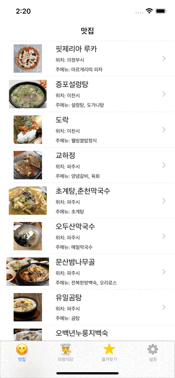
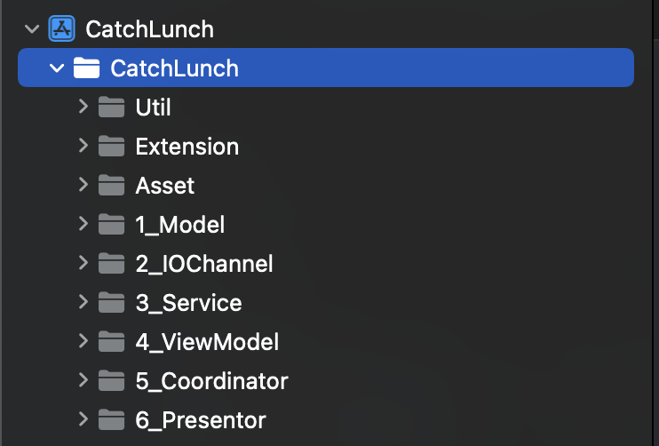
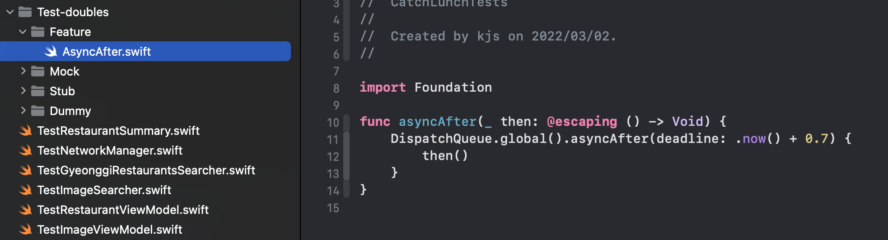
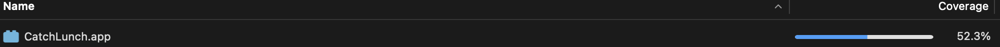

# CatchLunch, 맛집찾는 앱

| Catch Lunch | I'm hungry... look for 🍚 |
|:---:|:---:|
| [Plan](https://soo941226.notion.site/CatchLunch-4614ba8f91844695b8cb80124b234138) | [App Store Link](https://apps.apple.com/kr/app/catchlunch/id1614336988) |

---
## 사용한 기술

|Theme|List|
|:---:|:---|
| U.I. | - UIKit with Autolayout   - MapKit |
| Asynchronous Programming | - DispatchQueue |
| Network | - URLSession |
| Local DB | - CoreData |
| Public API | - [경기데이터드림 - 경기도 맛집](https://data.gg.go.kr/portal/data/service/selectServicePage.do?page=2&rows=10&sortColumn=&sortDirection=&infId=6T98794V0223GQQ9O1P42464027&infSeq=1&order=&loc=&searchWord=%EB%A7%9B%EC%A7%91&srvCd=A&RESTRT_NM=&REFINE_ROADNM_ADDR=)   - [경기데이터드림 - 경기도 모범식당](https://data.gg.go.kr/portal/data/service/selectServicePage.do?page=1&rows=10&sortColumn=&sortDirection=&infId=85K5H77PWPLDL7B4TNMK507168&infSeq=1&order=&loc=&searchWord=식당&srvCd=A)   - [Naver search API to search image](https://developers.naver.com/docs/search/image/)   - [Daum search api to search image](https://developers.kakao.com/docs/latest/ko/daum-search/dev-guide#search-image) |
| Test | - XCTest |
| Convention | - SwiftLint |

 

---

 

## 사용한 디자인패턴

 - Observer pattern
 - Coordiantor pattern
 - Delegation pattern
 - Factory pattern
 - MVVM
 
  

---

 

## 프로젝트 구성요소

1. Util
   * 아키텍처에 속하지 아니하면서, 앱을 구성하는데에 필요한 타입들

2. Extension
   * 아키텍처에 속하지 아니하면서, 이미 정의되어있는 타입을 확장하는 경우

3. Asset
   * 아키텍처에 속하지 아니하면서, 앱이 사용하는 문자열, 그림, 앱설정 등에 관한 내용들

4. Model
   * Entity 및 Model 정의

5. IOChannel
   * Entity를 가져오는 채널들을 정의

6. Service
   * IOChannel을 사용하면서, 가져온 Entity를 앱에서 사용하는 Model로 바꾸는 타입들
   * 이름처럼 실제로 유저가 사용하게 되는 서비스들

7. ViewModel
   * Service를 사용하면서 어떤 뷰에서도 그 기능을 온전히 수행할 수 있는 모델들

8. Coordinator
   * 첫번째로 Navigation에 관한 내용을 여기서 담당하게 됨
   * 두번째로 ViewModel을 생성하면서, 이때 Service를 ViewModel에 주입해주고, 다시 이를 Controller에게 넣어주게 됨
   * 현재에는 다른 타입들보다 많은 책임을 가지고 있고 처음에 생각했던 역할만을 하고 있지 않아서 수정이 필요한 부분

9. Presentor
   * UIView, UIViewController등이 속하게 됨

  

---

 

## 테스트 프로젝트 구성요소

1. Feature
    * 테스트를 위해 전역적으로 쓰이는 내용 정의

2. Mock
    * 기능을 테스트하기 위한 내용들 정의
    * MockSession, MockService 등

3. Stub
   * 테스트에 사용이 되면서 유의미한 값들을 정의

4. Dummy
   * 테스트에 사용이 되기는 하지만 무의미한 값들을 정의

5. Test---
   * 실제로 테스트 코드가 작성되는 XCTestCase를 상속받는 타입들을 정의

### 테스트 결과

* Presentor 로직들은 아직 공부와 경험이 부족하여 테스트를 하지 못했습니다
* 초기에는 coverage 100%를 목표로 TDD를 진행을 했지만, 이 과정에서 A타입에서 한번 테스트가 된 코드 블록이 B타입에서 다시 테스트되는 경우가 생겼습니다
* 커버리지를 높이기 위해 실제로 테스트를 하거나, 혹은 이 둘을 일반화한 뒤 해당 타입을 테스트를 하는 일을 할 수 있었으나, 단기적인 생산성의 측면에서 그러한 일을 하는 것은 세워두었던 목표에 어긋났기에 그냥 진행을 하게 되었습니다

---

[로고 이미지 출처](https://www.vecteezy.com/free-vector/meal)
